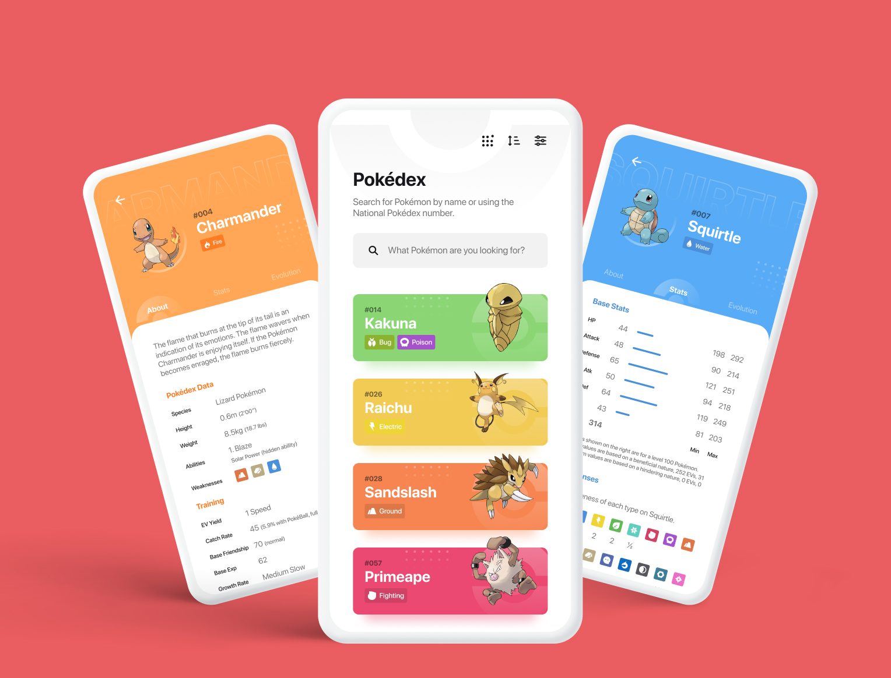

	<h2>Pokédex</h2>
	
Aplicativo desenvolvido para treinar habilidade em React Native, Typescript e animações com lottie e React Native Reanimated.

	

  

  

  

  
   

  

Made by <a href="https://jecianesilva.github.io/">Jeciane Amorim</a>

